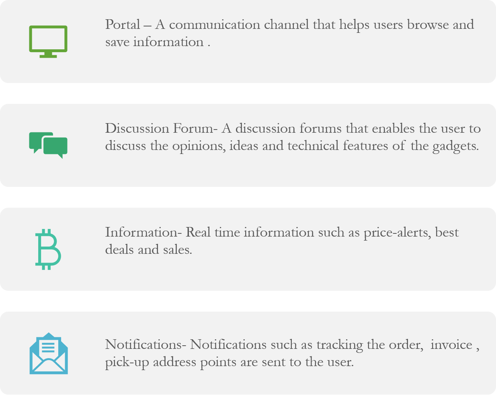

# Human-centered-design
Created a high fidelity click-through prototype in order to explore how to use computing technology to address relevant social problems and support positive community growth with the help of design principles learned in class.
# Problem Statement
Student life is often synonymous with strict budgeting. Gadgets like laptops, tablets, mobile phones are essential for a student in order to gain hands-on experience and knowledge besides the prescribed textbooks. The findings from our research threw light on the difficulties faced by students in need, in acquiring items that would help their studies, presentations and in laying road to a successful career.From our needfinding research, we found that the lack of a proper budget-friendly online store is a real issue as students are forced to scour the social media platforms for their needs.
#Design Goals

Format: 
#Prototype
After going  through the multiple trials of solution evaluation and validation to select the best of the conceptual models, mobile application turned out to be the most feasible and the best interface that can meet the defined usability and design goals.
The live prototype of our app can be found in the link below:
https://marvelapp.com/8e7h78b

#Evaluation Results
The focus was to help the students in solving their utility issues, thus relieving them of stress and enabling them to concentrate on their studies and research.
Reviews referred mostly to variables like efficiency, satisfaction and acceptance.
The evaluation results strongly support our usability goals and design goals.

#Lessons Learned
In order to build and design any application from scratch, it is extremely essential to understand the problem at hand, analyze it and then approach towards solving that problem. 
Interviews, questionnaires and walkthroughs gave us a broader understanding of the issues that were faced by the users and solving them.
Although it involves meticulous testing, in the current era, mobile phones are omnipresent and hence a mobile application is accessible all the time, easy to carry and efficient
